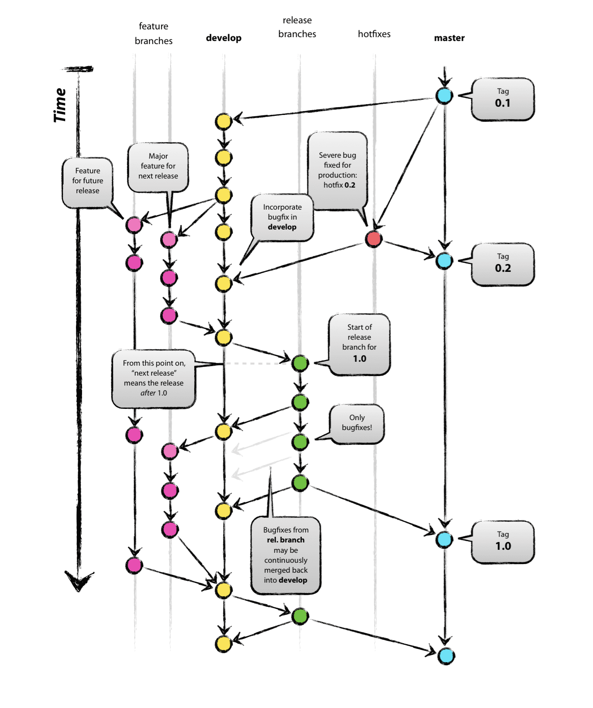
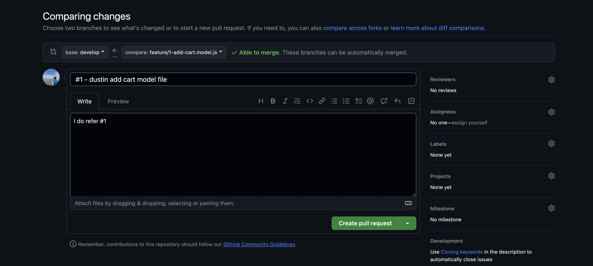
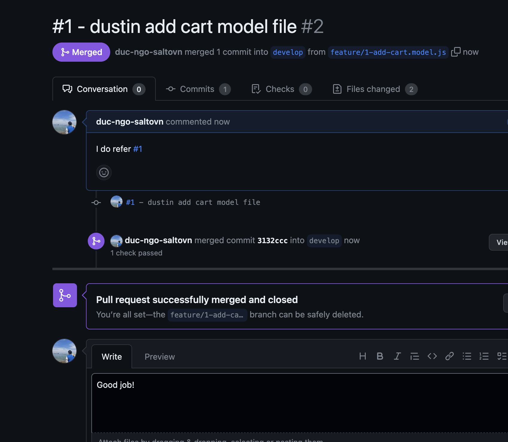

https://nvie.com/posts/a-successful-git-branching-model/
https://www.youtube.com/watch?v=vQgcl8VouLU

# Create new branch

[1] git push -u origin develop

# Create new branch 1 is issue number

[2] git checkout -b feature/1-add-cart.model.js develop

# Right Commit

[3] git commit -m '#1 - dustin add cart model file'

- 
- 

# Create new release branch 1.0.0

[4] git checkout -b release-1.0.0 develop

# Update release

git commit -m 'publish release v1.0.0'

# Create Tag

[5] git tag 'v1.0.0'

# Push Tag

[6] git push --tags

# Git merge develop

[7] git merge develop [8] git push --set-upstream origin release-1.0.0

# Check out master

[9] git tag 'v1.0.0'

# Remove branch Realease

[10] git branch -d release-1.0.0 [11] git push origin -d release-1.0.0

# Remove branch Feature

[12] git branch -d feature/1-add-cart.model.js [13] git push origin -d
feature/1-add-cart.model.js
